# TP1 Prise d'Android Studio et de Kotlin

## 1. Paramétrer l’environnement Android Studio

### 1.1 Création d'une application

Nous allons créer notre première application Android en Kotlin. Pour ce faire, deux étapes :

+ Choisir un type de projet. Dans notre cas, nous allons démarrer avec une application vide pour smartphone et tablette

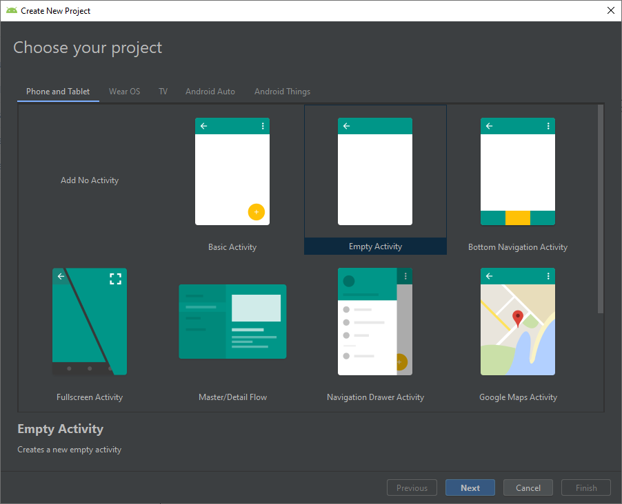

Ensuite, il faut choisir les informations de notre application.
+ ***Name*** : simplement le nom de notre application
+ ***Package name*** : chaque application Android possède un ID unique. Celui ci permet d'identifier l'application notamment sur le Google Play Store. Par exemple on pourrait choisir comme nom *com.polytech.tp1*
+ ***Language*** : pour nous, ce sera le **Kotlin** 😏
+ ***Minimum API Level*** : c'est la version la plus petite sur laquelle on souhaite déployer notre application. Plus la version est vieille, plus on touchera d'appareils. Seulement, certaines librairies et fonctionnalités ne seront pas utilisables. On choisit, pour ce cours, la **5.0 Lollipop** 🍭

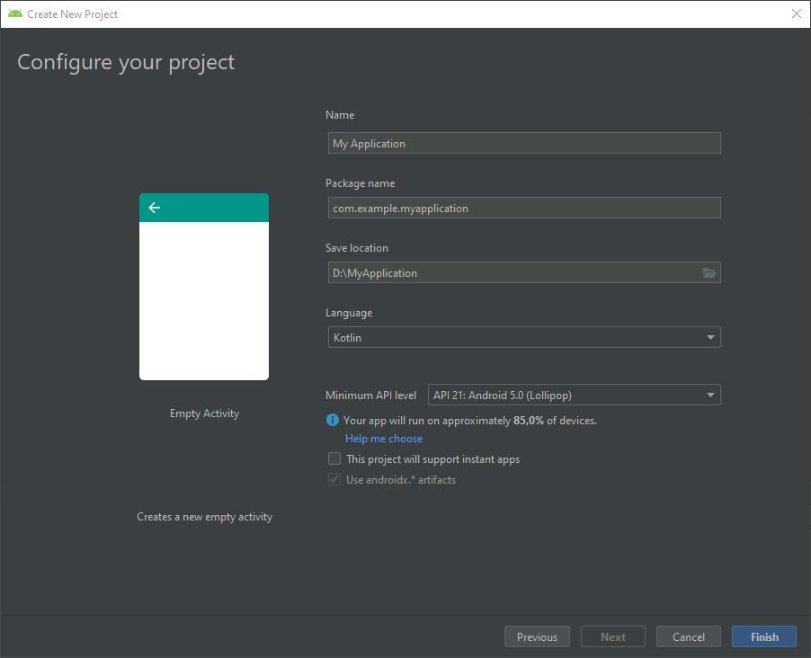

## 1.2 Découverte de l'environnement

Depuis quelques années, on peut remercier **JetBrains** d'avoir lancé **IntelliJ IDEA** car entre 2009 et 2014, c'était **Eclipse** qui faisait figure d'environnement de développement officiel ! 🙏

Mais **Android Studio** est juste basé sur le logiciel de JetBrains puisque c'est bien Google qui développe sa propre version spéciale pour Android.
Ne nous réjouissons pas trop vite ! Android Studio reste au premier abord une grosse machine à gaz avec de multiples boutons un peu partout.

Simplement, on retrouve les données principales comme sur la plupart des environnements de développement. Comme la structure du projet :

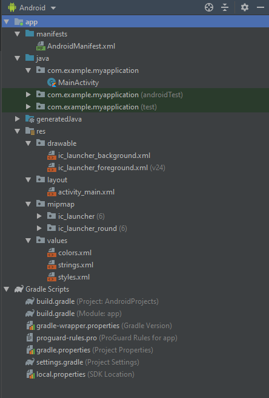

Découvrons un peu les fichiers que nous allons manipuler.

### 1.2.1 AndroidManifest.xml

On se souvient avoir évoqué les 4 principaux composants de notre application : les **Activités**, les **Services**, les **Récepteurs d’intentions** et **Fournisseurs de contenu**. C'est ici que nous les définirons. Mais pas que puisque on retrouve également son ID (package), les paramètres comme le nom, le thème ou encore les autorisations nécessaires pour intéragir avec le système (localisation, photo, internet...).

<div style="page-break-after: always;"></div>

Voici le fichier généré lors de la création d'une application :

```xml
<?xml version="1.0" encoding="utf-8"?>
<manifest xmlns:android="http://schemas.android.com/apk/res/android"
          package="com.example.myapplication">

    <application
            android:allowBackup="true"
            android:icon="@mipmap/ic_launcher"
            android:label="@string/app_name"
            android:roundIcon="@mipmap/ic_launcher_round"
            android:supportsRtl="true"
            android:theme="@style/AppTheme">
        <activity android:name=".MainActivity">
            <intent-filter>
                <action android:name="android.intent.action.MAIN"/>

                <category android:name="android.intent.category.LAUNCHER"/>
            </intent-filter>
        </activity>
    </application>

</manifest>
```

Pour plus de détails, rendez-vous ici : [App Manifest Overview]( https://developer.android.com/guide/topics/manifest/manifest-intro)

### 1.2.2 Le code Kotlin

Les classes se retrouvent dans le dossier portant le nom de notre package. Ici, on y retrouvera l'ensemble des classes liées à nos 4 composants mais également tous les fichiers de code en **Kotlin** *(.kt)* qui nous serviront à gérer notre application.

Voici le fichier **MainActivity.kt** qui est généré après avoir créé notre application.

```kotlin
package com.example.myapplication

import androidx.appcompat.app.AppCompatActivity
import android.os.Bundle

class MainActivity : AppCompatActivity() {

    override fun onCreate(savedInstanceState: Bundle?) {
        super.onCreate(savedInstanceState)
        setContentView(R.layout.activity_main)
    }
}
```

### 1.2.3 Les ressources

Le dossier **res** contient toutes les ressources que nous embarquerons avec notre application. On y retrouvera les images, les couleurs, les textes, les thèmes mais aussi les animations et les polices.

    res/
        drawable/
            graphic.png
        layout/
            main.xml
            info.xml
        mipmap/
            icon.png
        values/
            colors.xml
            strings.xml
            themes.xml

A l'image du **CSS** pour le web, on va essayer d'externaliser au maximum nos variables pour éviter la redondance de code. Les fichiers *colors.xml* et *themes.xml* nous y aideront.

On fera de même pour les textes. Le fichier *strings.xml* doit contenir l'ensemble des chaines de caractères que nous utiliserons dans notre application. Cela permettra de facilement gérer la traduction de notre application.

Pour ce qui est des images, c'est le dossier **drawable** qui nous intéressera.

Enfin, on déclarera nos vues au sein de **layout**. Eh oui, ici pas de **HTML** mais du **XML**. On y reviendra un peu plus tard.

Pour plus de détails, rendez-vous ici : [App resources overview](https://developer.android.com/guide/topics/resources/providing-resources). J'invite surtout à lire la partie sur les [resources alternatives](https://developer.android.com/guide/topics/resources/providing-resources#AlternativeResources) pour comprendre comment nous gérerons les différentes densités d'écran, orientations d'écran ou encore langues.

### 1.2.4 Gradle

Android Studio utilise **Gradle** pour gérer la compilation des ressources et du code.
Les propriétés et la configuration de notre projet seront déclarées dans le *build.gradle*. Toutes les dépendances à des librairies externes devront être intégrées ici.

Pour plus de détails, rendez-vous ici : [Configure your build](https://developer.android.com/studio/build)

<div style="page-break-after: always;"></div>

Les dépendances requises pour ce TP.

```gradle
...
dependencies {
    implementation fileTree(dir: 'libs', include: ['*.jar'])
    implementation "org.jetbrains.kotlin:kotlin-stdlib-jdk7:1.4.10"
    implementation 'androidx.appcompat:appcompat:1.3.1'
    implementation 'androidx.core:core-ktx:1.6.0'
    implementation 'androidx.constraintlayout:constraintlayout:2.1.1'
    implementation 'com.google.android.material:material:1.4.0'
    testImplementation 'junit:junit:4.13.2'
    androidTestImplementation 'androidx.test:runner:1.4.0'
    androidTestImplementation 'androidx.test.espresso:espresso-core:3.4.0'
}
```

## 1.3 Android SDK

Android Studio possède un gestionnaire pour le **Software Development Toolkit** d’Android. On y retrouve les différentes versions de plateforme que nous utiliserons pour tester notre application mais également les outils tels que *Android Emulator* pour la gestion des émulateurs ou *Google USB Driver* si vous souhaitez déployer sur votre téléphone.

Pour accéder aux informations du SDK :<br/>


Pour le développement sur un émulateur Android 9.0, il vous faudra au minimum installer :<br/>
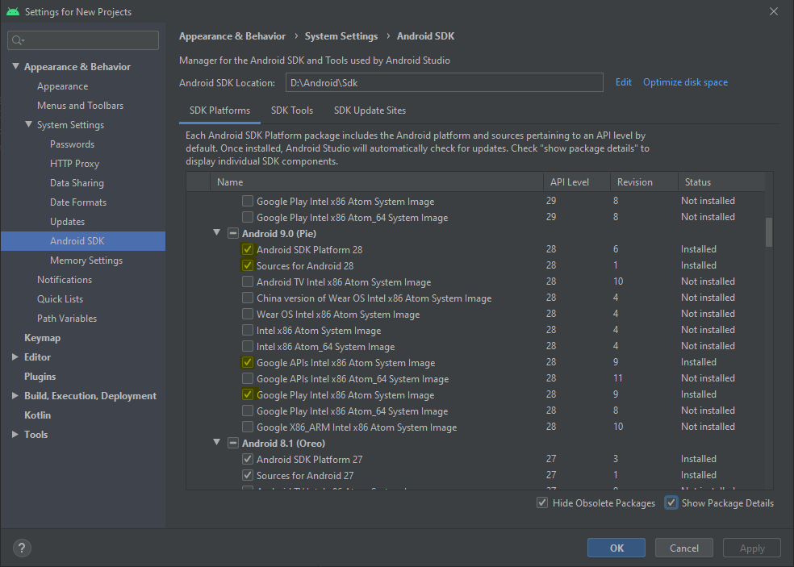

Pensez à cocher le Google USB Driver pour déployer sur votre smartphone ! 📱<br/>
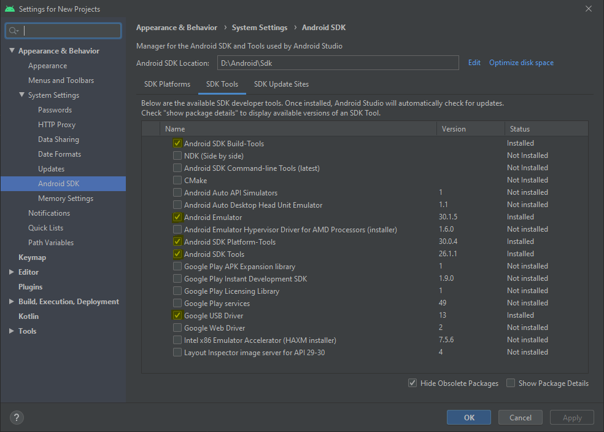

## 1.4 Emulateurs

Pour accéder au gestionnaire d'émulateur (AVD) :<br/>


## 1.5 Allons-y !

Découvrons désormais un peu plus en détail notre application de base.

Notre activité est bien définie par défaut dans le **AndroidManifest.xml"

```xml
...
<activity android:name=".MainActivity">
    <intent-filter>
        <action android:name="android.intent.action.MAIN"/>

        <category android:name="android.intent.category.LAUNCHER"/>
    </intent-filter>
</activity>
...
```

Son code d'exécution se trouve dans le fichier **MainActivity.kt**. On remarque ici que l'activité est liée à la vue via la procédure *setContentView()*.

```kotlin
...
class MainActivity : AppCompatActivity() {

    override fun onCreate(savedInstanceState: Bundle?) {
        super.onCreate(savedInstanceState)
        setContentView(R.layout.activity_main)
    }
}
```

<div style="page-break-after: always;"></div>

Notre activité est de type *AppCompatActivity*. C'est la classe de base pour les activités utilisant les fonctionnalités de la barre d’action. <br/>
La vue **res/layout/activity_main.xml** à l'écran est basée sur un *ConstrainLayout* qui contient une simple *TextView*.

```xml
<?xml version="1.0" encoding="utf-8"?>
<androidx.constraintlayout.widget.ConstraintLayout
        xmlns:android="http://schemas.android.com/apk/res/android"
        xmlns:tools="http://schemas.android.com/tools"
        xmlns:app="http://schemas.android.com/apk/res-auto"
        android:layout_width="match_parent"
        android:layout_height="match_parent"
        tools:context=".MainActivity">

    <TextView
            android:layout_width="wrap_content"
            android:layout_height="wrap_content"
            android:text="Hello World!"
            app:layout_constraintBottom_toBottomOf="parent"
            app:layout_constraintLeft_toLeftOf="parent"
            app:layout_constraintRight_toRightOf="parent"
            app:layout_constraintTop_toTopOf="parent"/>

</androidx.constraintlayout.widget.ConstraintLayout>
```

Le résultat est simple<br/>
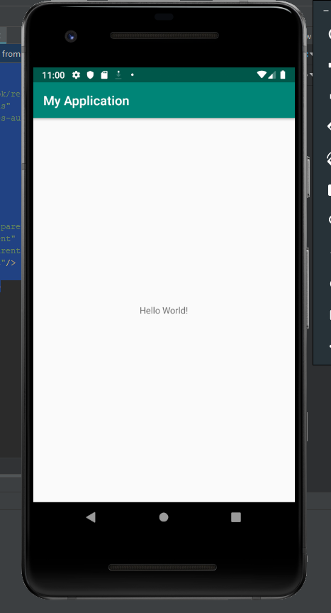

<div style="page-break-after: always;"></div>

### 1.5.1 Création de notre premier layout

Premièrement, il faut se rappeler que nous allons déclarer l'ensemble de nos textes dans **res/values/strings.xml**. Actuellement, le fichier contient le nom de l'application.

```xml
<resources>
    <string name="app_name">My Application</string>
</resources>
```

On va créer un premier texte :
```xml
<string name="hello">Bonjour, mon nom est : </string>
```

Pour utiliser ce texte dans le layout, on va changer **res/layout/main_activity.xml** la propriété ```android:text="Hello World"``` par ```android:text="@string/hello"```. Au passage, on va aussi ajouter une propriété d'idenfication à la vue ```android:id="@+id/tv_hello"```. Cela nous servira plus tard à travailler l'objet au niveau du code Kotlin.

Il existe un bon nombre de contrôles que nous pouvons utiliser : *TextView*, *Button*, *RadioButton*, *EditText*... ([Styles and Themes](https://developer.android.com/guide/topics/ui/look-and-feel/themes)). Des "ViewGroup" permettent de structurer notre interface utilisateur ([Declaring Layout](https://developer.android.com/guide/topics/ui/declaring-layout.html)) : *LinearLayout*, *ConstraintLayout*, *RelativeLayout*. Certains fonctionnent avec des "Adapter" comme la *ListView* ou la *GridView* et permettent de gérer des contenus dynamiques.

Nous allons également modifier notre interface utilisateur en utilisant le *LinearLayout*:

```xml
<?xml version="1.0" encoding="utf-8"?>
<LinearLayout
        xmlns:android="http://schemas.android.com/apk/res/android"
        xmlns:tools="http://schemas.android.com/tools"
        android:layout_width="match_parent"
        android:layout_height="wrap_content"
        tools:context=".MainActivity" >

    <TextView
            android:id="@+id/tv_hello"
            android:layout_width="wrap_content"
            android:layout_height="wrap_content"
            android:text="@string/hello"/>

</LinearLayout>
```

Ce type de *ViewGroup* permet de structurer nos contrôles verticalement ou horizontalement.<br />
Les propriétés ```android:layout_width``` et ```android:layout_height``` définissent la largeur et la hauteur de notre vue par rapport au parent. Ici c'est le *LinearLayout* qui fera office de parent. La valeur ```match_parent``` indique que notre layout prendra la totatilé de la largeur tandis que la valeur ```wrap_content``` indique que la hauteur s'adaptera à la somme des vues contenues dans le layout. 

Ajoutons désormais un deuxième *TextView* ainsi qu'un *EditText* et un *Button*.

```xml
    <TextView
            android:id="@+id/tv_name"
            android:layout_width="wrap_content"
            android:layout_height="wrap_content"/>

    <EditText
            android:id="@+id/ev_name"
            android:layout_width="wrap_content"
            android:layout_height="wrap_content"/>

    <Button
            android:id="@+id/bt_validate"
            android:layout_width="wrap_content"
            android:layout_height="wrap_content"
            android:text="@string/validate"/>
```

Bon, ça ne ressemble pas à grand chose ! Alors il faut structurer.<br />
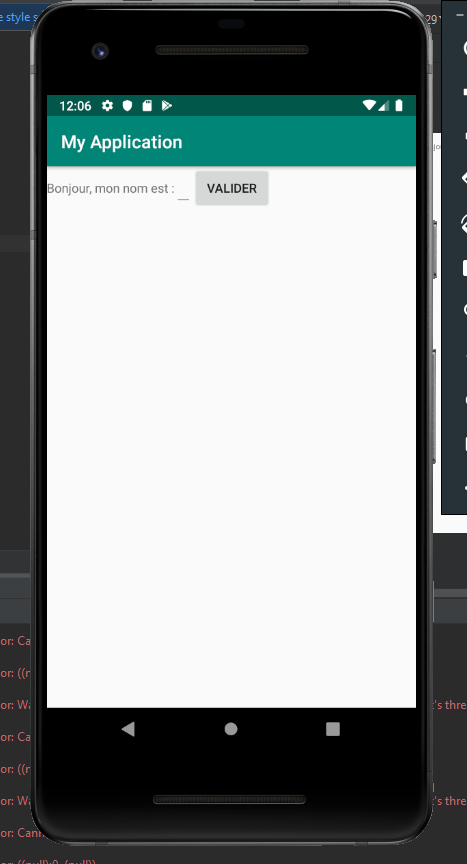

<div style="page-break-after: always;"></div>

Voici le nouveau code de la vue de l'activité :
```xml
<?xml version="1.0" encoding="utf-8"?>
<LinearLayout
        xmlns:android="http://schemas.android.com/apk/res/android"
        xmlns:tools="http://schemas.android.com/tools"
        android:layout_width="match_parent"
        android:layout_height="wrap_content"
        android:orientation="vertical"
        tools:context=".MainActivity"
        android:layout_margin="10dp"
        android:layout_gravity="center">

    <LinearLayout
            android:layout_width="match_parent"
            android:layout_height="wrap_content"
            android:layout_gravity="center">
        <TextView
                android:id="@+id/tv_hello"
                android:layout_width="0dp"
                android:layout_height="match_parent"
                android:layout_weight="1"
                android:text="@string/hello"/>

        <TextView
                android:id="@+id/tv_name"
                android:layout_width="0dp"
                android:layout_height="match_parent"
                android:layout_weight="1"/>
    </LinearLayout>

    <RelativeLayout
            android:layout_width="match_parent"
            android:layout_height="wrap_content">
        <EditText
                android:id="@+id/ev_name"
                android:layout_width="wrap_content"
                android:layout_height="wrap_content"
                android:layout_alignParentLeft="true"
                android:layout_alignParentRight="true"/>

        <Button
                android:id="@+id/bt_validate"
                android:layout_width="wrap_content"
                android:layout_height="wrap_content"
                android:layout_below="@id/ev_name"
                android:layout_centerInParent="true"
                android:text="@string/validate"/>
    </RelativeLayout>

</LinearLayout>
```

Et le résultat: <br />
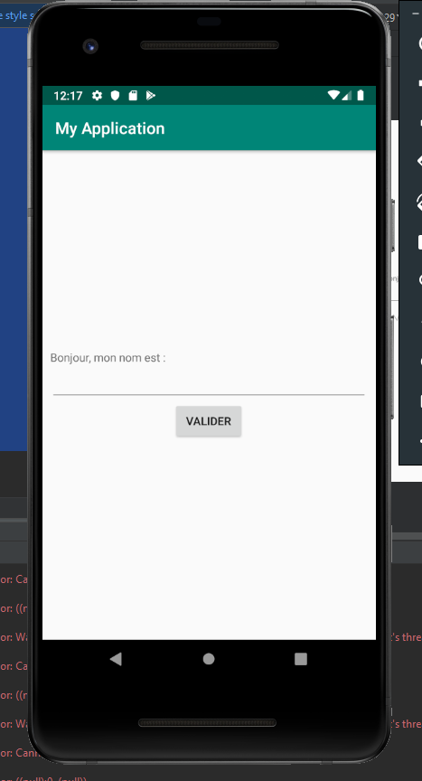

Beaucoup de changement donc. Déjà avec l'arrivée du *[RelativeLayout](https://developer.android.com/guide/topics/ui/layout/relative)*
 qui offre une mise en page plus complexe. Grâce à lui, on va pouvoir positionner nos vues en fonction du ViewGroup parent mais aussi en fonction des autres vues. L'exemple ici est l'alignement de l'*EditText* à gauche et à droite du ViewGroup parent puis du *Button* en dessous de l'*EditText* et centré dans le ViewGroup parent.
Toutes les propriétés sont à retrouver ici [Relative Layout Params](https://developer.android.com/reference/android/widget/RelativeLayout.LayoutParams.html)

On a également intégré la pondération au niveau du *[LinearLayout](https://developer.android.com/guide/topics/ui/layout/linear)*. Celle-ci permet de dire combien la vue. Ici, on a voulu que les deux *TextView* prennent la même largeur. On a donc remplacé ```android:layout_width="wrap_content"``` par ```android:layout_width="0dp"``` et intégré la propriété ```android:layout_weight="1"```. Vous pouvez changer de valeur de poids (entre 0 et l'infini) et vous verrez la différence.

### 1.5.2 Améliorer notre layout

**Attention, on va encore tout changer !**

Revenons au *[ConstraintLayout](https://developer.android.com/training/constraint-layout/index.html)*. Ce type d'UI est plus puissant que le *RelativeLayout* et permet d'éviter l'imbrication des ViewGroup. Alors comment ça marche ? Simplement, chaque vue dépend d'une autre vue. <br />
Les propriétés vont donc un peu changer et se présenter en ```app:layout_constraint1_to2Of``` avec 1 ou 2 égal à *Top*, *Bottom*, *Left*, *Right* ou même *Baseline*.
Un exemple simple pour une vue B ```app:layout_constraintLeft_toLeftOf="A"``` qui signifie que B se trouve au même niveau que la partie gauche de la vue A. <br />
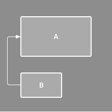

Toutes les possibilités sont ici : [Constraint Layout Params](https://developer.android.com/reference/androidx/constraintlayout/widget/ConstraintLayout)

<div style="page-break-after: always;"></div>

Bref passons au code et au résultat !

```xml
<?xml version="1.0" encoding="utf-8"?>
<androidx.constraintlayout.widget.ConstraintLayout
        xmlns:android="http://schemas.android.com/apk/res/android"
        xmlns:app="http://schemas.android.com/apk/res-auto"
        android:layout_width="match_parent"
        android:layout_height="match_parent"
        android:layout_margin="10dp">

    <TextView
            android:layout_width="0dp"
            android:layout_height="wrap_content"
            android:id="@+id/tv_hello"
            app:layout_constraintLeft_toLeftOf="parent"
            app:layout_constraintBottom_toTopOf="@+id/guideline"
            app:layout_constraintRight_toLeftOf="@id/tv_guideline"
            app:layout_constraintHorizontal_chainStyle="packed"
            android:text="@string/hello"/>

    <TextView
        android:layout_width="0dp"
        android:layout_height="wrap_content"
        android:id="@+id/tv_name"
        app:layout_constraintRight_toRightOf="parent"
        app:layout_constraintLeft_toRightOf="@id/tv_guideline"
        app:layout_constraintTop_toTopOf="@id/tv_hello"
        app:layout_constraintHorizontal_chainStyle="packed"/>

    <com.google.android.material.textfield.TextInputLayout
            android:id="@+id/ev_name"
            android:layout_width="match_parent"
            android:layout_height="wrap_content"
            app:layout_constraintTop_toBottomOf="@id/guideline">

        <com.google.android.material.textfield.TextInputEditText
                android:layout_width="match_parent"
                android:layout_height="wrap_content"
                android:hint="@string/your_name"
                android:inputType="text"/>

    </com.google.android.material.textfield.TextInputLayout>

    <com.google.android.material.button.MaterialButton
            android:id="@+id/bt_validate"
            android:layout_width="wrap_content"
            android:layout_height="wrap_content"
            android:text="@string/validate"
            app:layout_constraintTop_toBottomOf="@id/ev_name"
            app:layout_constraintLeft_toLeftOf="parent"
            app:layout_constraintRight_toRightOf="parent"/>

    <androidx.constraintlayout.widget.Guideline
            android:layout_width="wrap_content"
            android:layout_height="wrap_content"
            android:id="@+id/tv_guideline"
            android:orientation="vertical"
            app:layout_constraintGuide_percent="0.5"/>

    <androidx.constraintlayout.widget.Guideline
            android:layout_width="wrap_content"
            android:layout_height="wrap_content"
            android:id="@+id/guideline"
            android:orientation="horizontal"
            app:layout_constraintGuide_percent="0.45"/>

</androidx.constraintlayout.widget.ConstraintLayout>
```

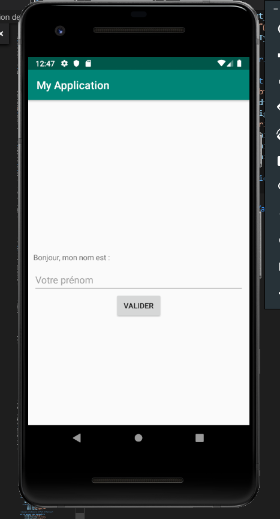

En somme, on a réalisé le même écran que précédemment mais comme on l'a dit, sans imbrication de *Layout*. On utilise des *Guideline* pour disposer nos éléments dans notre vue.

Petite nouveauté, qu'on aurait aussi pu utiliser sur l'écran précédent : **Material Design**.  Introduites en version 5.0, ces règles de design vont vous permettre d'avoir une application dans l'air du temps. <br />

**Attention, pensez à changer le thème de votre application si vous souhaitez utiliser Material Design** <br/>
Direction ```res/values/styles.xml```
```xml
    <style name="AppTheme" parent="Theme.MaterialComponents">
```

Les vues utilisables sont disponibles dans la rubrique Components du [site officiel de Material Design](https://material.io/develop/android/)

### 1.5.3 Petit point sur Android Jetpack

Avec l'arrivée de Kotlin mais aussi de la structuration des applications, Android a décidé de mettre de l'ordre dans ses composants et fonctionnalités. [Android Jetpack](https://developer.android.com/jetpack) a donc été mis en place pour contenir les nouvelles bibliothèques et les nouveaux outils ce qui signifie un gros changement dans la façon de coder une application Android. Auparavant, il fallait attendre les mises à jour de la plateforme Android et l'arrivée d'une nouvelle version pour voir apparaitre de nouveaux composants. Maintenant, ceux-ci sont indépendants et sont à retrouver dans le package dédié *androidx.*.

**Point à noter, vous trouverez beaucoup d'ancien code sur les sites tels que Stackoverflow. Pour utiliser les bons package de AndroidX pour vos vues, [rendez-vous ici](https://developer.android.com/jetpack/androidx/migrate)**

On utilisera donc Android Jetpack tout au long de ce cours lorsqu'on parlera aussi de l'architecture (le Data Binding, les ViewModel, les Repository, Room...)

En résumé :
+ Chaque activité est composée d'une classe en Kotlin et d'un layout au format XML
+ La méthode ```setContentView()``` permet d'associer le layout à l'activité.
+ Les vues peuvent être groupées dans des *ViewGroup* comme le ```LinearLayout``` ou le ```RelativeLayout```
+ Une vue est identifiée par l'attribut ```android:id``` et est récupérée dans l'activité avec la méthode ```findViewById()```
+ ```android:layout_width``` et ```android:layout_height``` sont utilisés pour définir la taille de nos vues
+ Le dossier *drawable* contient les resources images
+ On déclare nos resources textes dans le fichier ```values/res/strings.xml```, nos resources couleurs dans le fichier ```values/res/colors.xml``` et nos styles dans le fichier, nos resources couleurs dans le fichier ```values/res/styles.xml```
+ ```ConstraintLayout``` permet de créer des mises en page plus performantes et plus flexibles en se définissant la position d'une vue en fonction des autres vues
+ Les avantages du ```ConstraintLayout``` sont notamment qu'il permet de réaliser des vues plus responsive et d'éviter la multiplication des imbrications de ```LinearLayout``` et ```RelativeLayout```

<div style="page-break-after: always;"></div>

# 2 Kotlin

Il est temps de passer au code de notre activité et de découvrir Kotlin. Retour dans le fichier suivant **java/com.example.myapplication/MainActivity.kt**

```kotlin
...
class MainActivity : AppCompatActivity() {

    override fun onCreate(savedInstanceState: Bundle?) {
        super.onCreate(savedInstanceState)
        setContentView(R.layout.activity_main)
    }
}
```

On observe déjà des changements dans l'écriture du code notamment au niveau de la déclaration de la classe, de l'héritage ou encore de l'écriture d'une fonction. Mais quelque chose ne vous à pas sauter à l'oeil ? Le point virgule **```;```** ! Ce petit caractère qu'on ajoute à la fin de chacune de nos lignes n'est en effet pas obligatoire en Kotlin.

Bien évidemment, Kotlin est un langage orienté objet et nous allons en découvrir ses subtilités. Car, comme vous allez le voir, votre code va se réduire de ligne en ligne.

[Rendez-vous ici pour tester votre code](https://play.kotlinlang.org/)

## 2.1 Un temps variable

### 2.1.1 Le typage

Un point proche du C# : le typage dynamique. Vous n'aurez plus besoin de déclarer les types de vos variables, c'est le compilateur qui va se débrouiller seul pour le déduire.

Votre code Java...
```java
String text = "bonjour";
int num = 8;
```

... va pouvoir devenir en Kotlin
```kotlin
val text: String = "bonjour" / val text = "bonjour" / var text = "bonjour"
val num: Int = 8 / val num = 8 / var text = 8
```

On observe deux types de nommage avec ```val``` et ```var```. Tout simplement le premier pour *valeur* et le second pour *variable*.<br/>
Si vous décidez d'utiliser ```val```, votre variable ne sera plus modifiable après sa déclaration soit *immuable* comme avec le ```final``` en java.<br/>
Si vous décidez d'utiliser ```var```, elle sera donc *muable* et modifiable dans la suite de votre code.

### 2.1.2 Sans nul doute 

Autre point qui ne va pas vous dépayser du C# : le **[Null Safety](https://kotlinlang.org/docs/reference/null-safety.html)**.

Je prends ici simplement l'exemple du lien ci-dessus.

```kotlin
var a: String = "coucou"
a = null // erreur de compilation
```

Ce code ne peut être exécuté par le compilateur. Il faut lui spécifier que la variable peut prendre la valeur ```null```. Il faut alors utiliser le typage spécifique : ```String?```.

```kotlin
var a: String? = "coucou"
```

Pour vérifier si votre variable n'est pas vide, vous auriez tendance à écrire ceci :
```kotlin
val l = -1
if (b != null)
    l = b.length
```

En Kotlin, on peut facilement simplifier le code :

```kotlin
val l = if (b != null) b.length else -1
```

Que dis-je !

```kotlin
val l = b?.length ?: -1
```

Ici on a introduit deux notions :
- Un simple ```?``` qui permet d'utiliser la variable tout en évitant le fameux  *NullPointerException*.
- L'opérateur d'Elivis ```?:``` qui permet de dire d'effectuer le *if..else*

A l'infini, on pourrait écrire le code suivant qui nous évite de dire *"si bob n'est pas null et si le département de bob n'est pas null et si le chef du département de bob n'est pas null alors on récupère son nom"*

```kotlin
bob?.department?.head?.name
```

### 2.2.3 On se voit plus tard

Si vous souhaitez déclarer une variable que vous n'utiliserez pas tout de suite et que vous ne souhaitez pas que celle-ci prenne la valeur ```null```, par exemple pour une variable de classe, alors on va utiliser ```lateinit```.

```kotlin
lateinit var value: int
```

## 2.3 J'embarque ma fonction

### 2.3.1 Le détail

La déclaration d'une fonction est simple :

```kotlin
fun sum(a: Int, b: Int): Int {
    return a + b
}
```

- ```fun``` est le mot clé pour définir une fonction
- ```sum``` est le nom de la fonction
- ```b: Int``` avec ```b``` comme nom de variable et ```Int``` comme type de variable
- ```Int``` est le type retourné par la fonction

Pour simplifier le tout, Kotlin permet d'écrire plus facilement une fonction qui possède une expression ( = morceau de code qui retourne une valeur ≠ instruction).

```kotlin
fun sum(a: Int, b: Int): Int = a + b
```

Jusqu'à faire disparaitre le type de retour qui est déduit automatiquement grâce à l'[inférence de types](https://fr.wikipedia.org/wiki/Inf%C3%A9rence_de_types).

```kotlin
fun sum(a: Int, b: Int) = a + b
```

Un autre exemple avec les expressions conditionnelles :

```kotlin
fun maxOf(a: Int, b: Int): Int {
    if (a > b) {
        return a
    } else {
        return b
    }
}
```

```kotlin
fun maxOf(a: Int, b: Int) = if (a > b) a else b
```

### 2.3.2 λ

Les lambdas vous aideront à simplifier votre code.
Notamment quand nous voudrons gérer certains événements venus de notre interface utilisateur.

```kotlin
val sum = { a: Int, b: Int => a + b }
```

Mais aussi si on souhaite passer une fonction en paramètre d'une autre fonction. Oui c'est possible !

```kotlin
inline fun age(x:Int, function: (x: Int) -> Unit)
{
    println("Bienvenue sur ma page")
    function(x)
}

age(14, { x:Int ->  println("Mon age est $x ans") })
```

Le type de retour ```Unit``` correspond simplement au ```void``` en Java.
Pour le mot clé ```inline``` il permet d'optimiser le code qui va être compilé. Je vous laisse l'exemple d'OpenClassroom qui explique clairement ce cas :

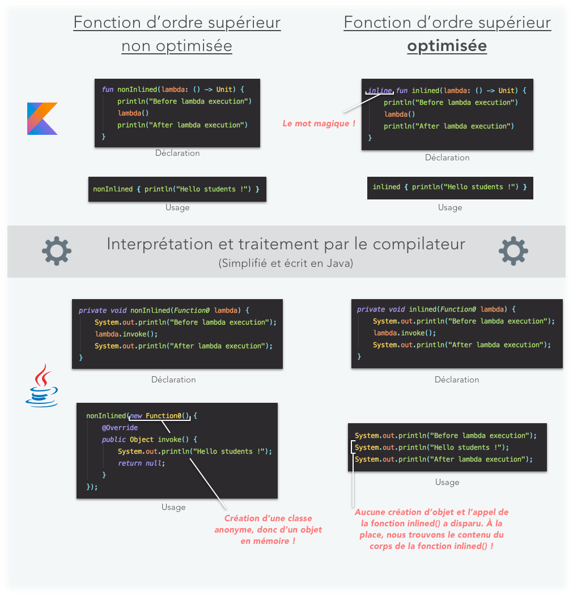

Pour retrouver les possibilités de simplifier votre code et aller plus loin, je vous laisse découvrir [le lien suivant](https://openclassrooms.com/fr/courses/5353106-initiez-vous-a-kotlin/5354822-tirez-parti-des-lambdas#/id/r-5451491) qui vous présente notamment ```apply```, ```let``` mais aussi les fonctions pour gérer vos collections comme ```count```, ```find``` ou  ```any```.

## 2.4 La base

Le for loop :
```kotlin
val items = listOf("apple", "banana", "kiwifruit")
for (item in items) {
    println(item)
}
```

Le ```switch``` de java est remplacé par ```when```

```kotlin
    when (obj) {
        1          -> "One"
        "Hello"    -> "Greeting"
        is Long    -> "Long"
        !is String -> "Not a string"
        else       -> "Unknown"
    }
```

Les syntaxes de bases sont [à retrouver ici](https://kotlinlang.org/docs/reference/basic-syntax.html)

<div style="page-break-after: always;"></div>

## 2.5 C'est la classe

On va terminer cette découverte de Kotlin par les classes. Cette partie ne va pas déroger à la règle de la simplification. 

### 2.5.1 A la découverte de la classe

On connait tous le moment où on doit écrire une classe comme celle-ci en Java :

```java
public class Person {

    private String lastname;
    private String firstname;
    private int age;
    
    public Person(String lastname, String firstname, int age){
        this.lastname = lastname;
        this.firstname = firstname;
        this.age = age;
    }

    public String getLastname()
    { return lastname ; }

    public String getFirstname()
    { return firstname ; }

    public int getAge()
    { return age ; }

    public String setLastname(String lastname)
    { this.lastname = lastname; }

    public String setFirstname(String firstname)
    { this.firstname = firstname; }

    public int setAge(int age)
    { this.age = age; }
}
```

Eh bien c'est terminé.

```kotlin
class Person(var lastname: String, var firstname: String, var age: Int)
```

En une ligne, nous avons déclaré le constructeur primaire de la classe ainsi que ses propriétés.

On instanciera notre classe ainsi, sans ```new```.
```kotlin
val person = Person("Doe", "John", 35)
println(person.age) // affichera 35
person.age = 34
```

Mais si vous souhaitez bloquer vos propriétés seulement en lecture, il faudra utiliser le mot clé immuable ```val```.

```kotlin
class Person(var lastname: String, var firstname: String, val age: Int)
```

Ainsi, on ne pourra plus modifier la propriété *age*. Et si on ne veut pas accéder à celle-ci on écrira

```kotlin
class Person(var lastname: String, var firstname: String, private var age: Int)
```

Si vous souhaitez tout de même avoir un corps pour votre constructeur principal, il suffit d'ajouter le bloc ```init```.

```kotlin
class Person(var lastname: String, var firstname: String, private var age: Int)
{
    init {
        println("initialisation")
    }
}
```

### 2.5.2 Soyons plus classe

Souvent on voudra améliorer notre classe et notamment effectuer des actions lors de la modification des propriétés. Il faut alors retirer le mot clé utilisé dans le constructeur de classe puis déclarer la propriété au sein de la classe avec les methodes getter et setter.

Egalement, on peut vouloir déclarer de nouveaux constructeurs. On utilisera le mot clé ```constructor```.

```kotlin
class Person(var lastname: String, var firstname: String, age: Int){

    var age: Int = age
        get() { return field }
        set(value) { println("edit"); field = value }

    constructor(): this("Unknown","Unknown",0)

    constructor(lastname: String, firstname: String): this(lastname,firstname,0)

}
```

### 2.5.3 Héritage

On l'a déjà vu avec notre classe ```MainActivity```, elle hérite de ```AppCompatActivity```.

```kotlin
class MainActivity : AppCompatActivity()
```

Mais comment cela se passe derrière ? Si je veux que ma classe ```Person``` devienne parent ?

En Kotlin, par défaut, les classes sont fermées. C'est à dire, on ne peut pas hériter de celle-ci, ni redéfinir ses méthodes. Aie ! Oui mais cela respecte les règles de base de la programmation objet. Alors comment faire ? C'est simple, il faut utiliser la propriété ```open```.

```kotlin
open class Person(var lastname: String, var firstname: String, var age: Int){

    fun identity() {}
}
```

Donc si je veux créer la classe *Woman* et redéfinir je vais pouvoir écrire cela ?

```kotlin
class Woman : Person(){
    override fun identity() {}
}
```

Noooon 😦 Les méthodes sont considérées par défaut comme ```final``` car tout est fermé. Il faut également ouvrir nos méthodes

```kotlin
open class Person(var lastname: String, var firstname: String, var age: Int){

    open fun identity() {}
}
```

Si vous le souhaitez vous pouvez aussi rendre votre classe abstraite.

```kotlin
abstract class Person(var lastname: String, var firstname: String, var age: Int){

    abstract fun identity() {}
}
```

En résumé :
- ```final``` : par défaut, tous les éléments (classe ou méthode ou propriété) de code sont dans cet état. Aucune redéfinition n'est alors possible.

- ```open``` : les éléments (classe ou méthode ou propriété) seront modifiables.

- ```abstract``` : les éléments (classe ou méthode ou propriété) seront à redéfinir.

### 2.5.4 Données données données... ♪

Dans nos développements, nous aurons besoin de modèle de données.

```kotlin
data class Person(var lastname: String, var firstname: String, var age: Int)
```

 En ajoutant le mot clé ```data```, nous allons pouvoir générer automatiquement les fonctions suivantes :

- ```equals()/hashCode()``` pour tester les égalités entre les classes
- ```toString()``` qui retournera "Person(lastname=John, firstname=Doe, age=35)";
- ```copy()``` qui pourra être utilisé pour copier les données vers un nouvel objet.

```kotlin
val john = Person("John", "Doe", 35)
val older = john.copy(age = 36)
```

### 2.5.5 Le top du top

La notion ```static``` n'existe pas en Kotlin.  Nous pouvons créer des fonctions qui n'appartiennent pas à des classes. Exemple, avec la classe Utils où d'habitude, nous stockons un tas de fonctions statiques ou propriétés constantes. On appelle cela le Top-level.

Dans un fichier ***utils.kt***, on aura notre code en premier niveau :
```kotlin
package utils

const val URL = "https://www.api.com/"

fun equal(a: Int, b: Int): Boolean = a == b
```

Si on veut utiliser dans un autre fichier on déclarera en en-tête :

```kotlin
import utils.URL
import utils.equal
```

<div style="page-break-after: always;"></div>

Par contre, si on souhaite que notre classe possède des fonctions statiques dans le but de les utiliser sans que l'objet soit instancié, il faudra procéder avec l'objet ```companion```.

```kotlin
data class Person(var lastname: String, var firstname: String, var age: Int) {

    companion object {
        fun newDoePerson(firstname: String, age: Int) = Person("Doe", firstname, age)
    }

}

val person = Person.newDoePerson("Marc",12)
```

### 2.5.6 Singleton

```kotlin
object Singleton {
}
```

Toujours aussi simple ! Oui, nous venons de créer un singleton. Efficacité maximum avec le mot clé ```object```.

<hr/>

J'aurais pu vous présenter également les extensions, allé un peu plus dans le détail sur certaines parties... mais ce n'est pas l'objet principal de ce cours. Normalement, vous avez les bases pour coder en Kotlin. Des sites comme Openclassroom ou simplement la documentation de Kotlin vous aiderons à en savoir plus. 😉

<div style="page-break-after: always;"></div>

# 3 Retour à nos moutons 🐑

## 3.1 Intéragir avec les vues

Nous avons désormais toutes les bases pour compléter notre première application.

Pour pouvoir mettre à jour nos vues et intéragir avec elles, il faut les récupérer dans notre activité. Pour ce faire, nous avons auparavant utilisé l'attribut ```id``` au sein de notre layout pour affecter un nom à nos vues. Dans notre code d'activité, il faut utiliser la méthode ```findViewById()``` qui va retourner la vue en la castant dans le bon type passé.

```kotlin
val btValidate = findViewById<MaterialButton>(R.id.bt_validate)
```

Si on souhaite récupérer l'action de clic sur le bouton valider, il faut utiliser le code suivant :

```kotlin
override fun onCreate(savedInstanceState: Bundle?) {
        super.onCreate(savedInstanceState)
        setContentView(R.layout.activity_main)

        val btValidate = findViewById<MaterialButton>(R.id.bt_validate)
        val tvName = findViewById<TextView>(R.id.tv_name)
        val tiName = findViewById<TextInputEditText>(R.id.ti_name)

        btValidate.setOnClickListener {
            tvName.text = tiName.text
            val myToast = Toast.makeText(this, "Le nom a été mis à jour", Toast.LENGTH_SHORT)
            myToast.show()
        }

}
```

Désormais, nous pouvons rentrer notre nom, valider et compléter le texte à l'écran. Un toast a été ajouté afin de signifier la mise à jour à l'utilisateur.

## 3.2 Notre seconde activité

Nous allons désormais créer notre deuxième activité. 

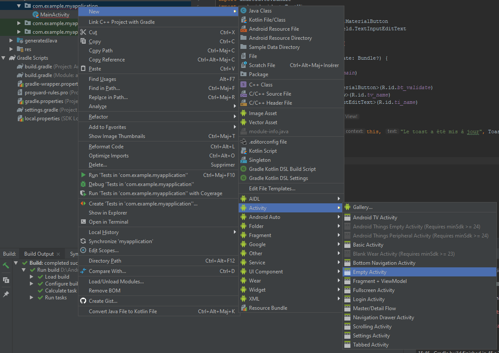
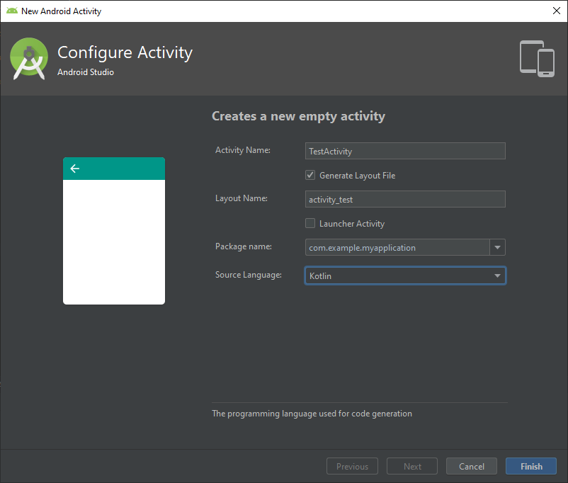

Automatiquement, Android Studio va nous ajouter notre layout xml et notre classe Kotlin.

Il va aussi déclarer l'activité au sein du manifeste.
```xml
<activity android:name=".TestActivity">
</activity>
````

Dans notre première activité, on va ajouter un deuxième bouton afin de pouvoir changer de page.

```xml
  <com.google.android.material.button.MaterialButton
            android:id="@+id/bt_skip"
            android:layout_width="wrap_content"
            android:layout_height="wrap_content"
            android:text="@string/skip"
            app:layout_constraintTop_toBottomOf="@id/bt_validate"
            app:layout_constraintLeft_toLeftOf="parent"
            app:layout_constraintRight_toRightOf="parent"/>
```

Au niveau du code, le passage d'une vue à une autre se fait grâce aux intentions. Cet objet porte bien son nom puisqu'il annonce que *"j'ai l'intention de faire quelque chose..."*, en l'occurrence, ouvrir une nouvelle activité. Mais cela pourrait aussi être l'ouverture d'une fonctionnalité externe à l'application (page internet, ...). Après la création de cette intention, nous allons utiliser la méthode ```startActivity``` qui enverra l'intention au framework.

```kotlin
val btSkip = findViewById<MaterialButton>(R.id.bt_skip)

btSkip.setOnClickListener {
    val testActivityIntent = Intent(this, TestActivity::class.java)

    startActivity(testActivityIntent)
}
```

## 3.3 Passe le message à ton voisin

Imaginons maintenant que nous souhaitons passer en paramètre à notre seconde activité le prénom qui sera complété (ou non). Il faudra étiqueter cette donnée. Pour ce faire, il faut créer une variable qui va servir de clé d'identification dans notre seconde activité.

```kotlin
companion object {
        const val NAME = "name"
}
```

Puis utiliser la méthode ```putExtra``` pour introduire l'information supplémentaire.

```kotlin
testActivityIntent.putExtra(TestActivity.NAME, tvName.text.toString())
```

Désormais, on va afficher la donnée dans la seconde activité en récupérant la valeur :

```xml
<string name="skip">Passer l\'étape</string>
```

```xml
<?xml version="1.0" encoding="utf-8"?>
<androidx.constraintlayout.widget.ConstraintLayout
        xmlns:android="http://schemas.android.com/apk/res/android"
        xmlns:tools="http://schemas.android.com/tools"
        xmlns:app="http://schemas.android.com/apk/res-auto"
        android:layout_width="match_parent"
        android:layout_height="match_parent"
        tools:context=".TestActivity">

    <TextView
            android:layout_width="0dp"
            android:layout_height="wrap_content"
            android:id="@+id/tv_test_name"
            android:textSize="20sp"
            android:textAlignment="center"
            app:layout_constraintRight_toRightOf="parent"
            app:layout_constraintLeft_toLeftOf="parent"
            app:layout_constraintTop_toTopOf="parent"
            app:layout_constraintBottom_toTopOf="@+id/tv_test_code"/>

    <TextView
            android:layout_width="0dp"
            android:layout_height="wrap_content"
            android:id="@+id/tv_test_code"
            android:textSize="50sp"
            android:textAlignment="center"
            app:layout_constraintRight_toRightOf="parent"
            app:layout_constraintLeft_toLeftOf="parent"
            app:layout_constraintTop_toBottomOf="@id/tv_test_code"
            app:layout_constraintBottom_toBottomOf="parent"/>


</androidx.constraintlayout.widget.ConstraintLayout>
```

<div style="page-break-after: always;"></div>

```kotlin
private var code: Int = 0

override fun onCreate(savedInstanceState: Bundle?) {
    super.onCreate(savedInstanceState)
    setContentView(R.layout.activity_test)

    val name = intent.getStringExtra(NAME)
    val tvName = findViewById<TextView>(R.id.tv_test_name)
    val tvCode = findViewById<TextView>(R.id.tv_test_code)

    tvName.text = "Le code de $name"

    code = if (!name.isNullOrEmpty()) tvName.length() + Random().nextInt(tvName.length()) else 0
    tvCode.text = code.toString()
}
```

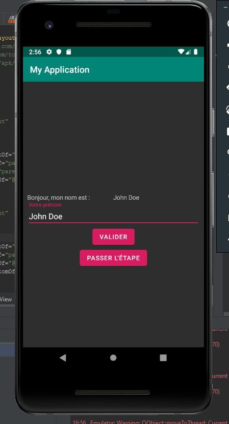

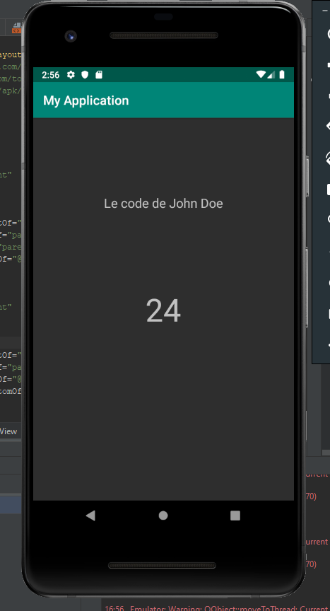

## 3.4 Retour à l'envoyeur

Pour terminer, nous allons retourner le code généré à la première vue. Il faut alors modifier quelques lignes au niveau du démarrage de l'activité.

Nous utilisons maintenant la méthode ```startActivityForResult``` qui prend toujours en paramètre notre intention mais également un code d'identification de l'activité. En effet, lors du retour, nous aurons besoin de savoir quelle activité effectue son retour.

```kotlin
companion object {
    const val START_TEST_ACTIVITY = 1
}
```

```kotlin
startActivityForResult(testActivityIntent, START_TEST_ACTIVITY)
```

Il faut donc une fonction *"callback"* pour récupérer le code renvoyé par la deuxième activité. Dans celle-ci, nous vérifions si nous c'est bien cette activité qui nous retourne des informations et si ces informations sont exploitables.

```kotlin
override fun onActivityResult(requestCode: Int, resultCode: Int, data: Intent?) {
    if (requestCode == START_TEST_ACTIVITY) {
        if (resultCode == Activity.RESULT_OK) {
            val code = data?.getIntExtra(CODE,0)
            println(code)
        }
    }
}
```

Enfin, au sein de la seconde activité, nous allons créer l'intention de retour. Celle-ci se fera dans la méthode finish qui est appelée à la fermeture de l'activité.

```kotlin
override fun finish() {
    val returnIntent = Intent()
    returnIntent.putExtra(MainActivity.CODE, code)
    setResult(Activity.RESULT_OK, returnIntent)
    super.finish()
}
```

Dans la console on aura le code affiché.
```
I/System.out: code 24
```

En résumé :
+ ```setOnClickListener() ``` est la fonction qui permet de gérer l'événement de clic dans notre activité. L'équivalent au sein du layout est l'attribut ```android:onClick```
+ Les ```Intent``` permettent de donner des intentions d'execution à l'application
    + ```startActivity()``` permet de lancer une nouvelle activité
    + ```putExtra()``` permet d'embarquer des objets lors du changement d'activité
    + ```startActivityForResult()``` donne la possibilité de retourner des informations à la fermeture de l'activité ouverte

